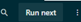
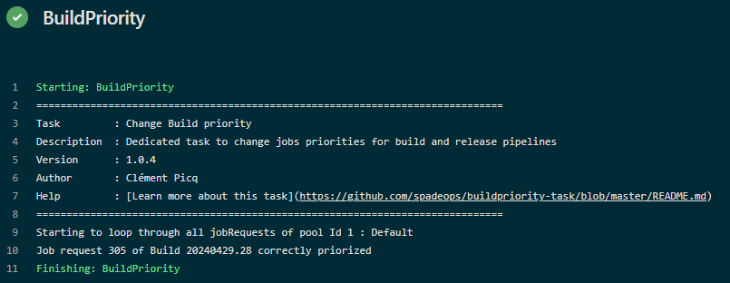
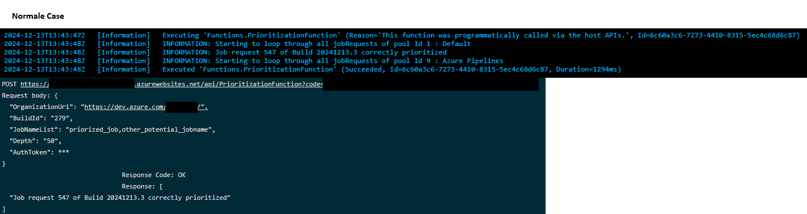
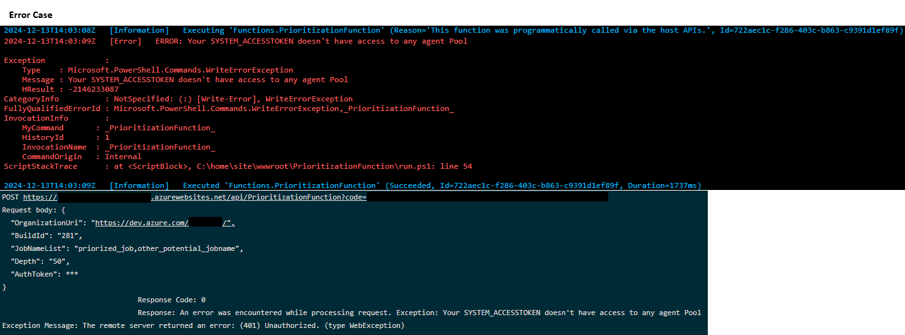

# BuildPriority
[](https://github.com/SpadeOps/buildpriority-task/blob/main/LICENSE)  [](https://www.spadeops.com/)

This Azure Pipelines task prioritize specifics jobs of a pipeline. It will loop through all pools (if none given) and through all Job request still in queue.
It will do the exact same thing as the  button of a pipeline.
If any JobRequests are started by the given Pipeline, the task will increase its priority. Possibility to restrict prioritization to only specific given JobNames.
To offer a more convenient usage in your workflow, we also want to propose an alternative [agentless solution](#agentless-solution) that doesn't use an extension, but use a call to an Azure function instead.

# Agent based task solution
## Usage
### Inputs
```yaml
- task: BuildPriority@1
  inputs:
    # The complete URI for your Organization in Azure DevOps
    #
    # Example: https://dev.azure.com/Fabrikam
    #
    # Required. Default: [$(System.CollectionUri)](https://learn.microsoft.com/en-us/azure/devops/pipelines/build/variables?view=azure-devops&tabs=yaml)
    input_OrganizationUri: '$(System.CollectionUri)'
    
    # Build ID or Release deployment ID from which you want to change priority.
    # The value must be an integer
    #
    # Example: 120
    #
    # Required. Default: [$(Build.BuildId)](https://learn.microsoft.com/en-us/azure/devops/pipelines/build/variables?view=azure-devops&tabs=yaml)
    input_BuildId: '$(Build.BuildId)'
    
    # List of job names that will be prioritized. If no job names are given, all jobs of the build will be priorized.
    # The value must be a list of string, separated with a comma
    #
    # Example: 'priorized_job,other_potential_jobname'
    #
    # Optional. Default: ''
    input_JobNameList: ''

    # List of all Agent Pools that need to be investigated. This value is only for optimization purpose. If no Pool IDs are given, 
    # all Agent Pool IDs will be investigated.
    # The value must be a list of integer, separated with a comma
    #
    # Example: 'priorized_job,other_potential_jobname'
    #
    # Optional. Default: ''
    input_PoolIdList: ''
    
    # Depth for the search of JobRequests. This value is only for optimization purpose. We will only look for the first {Depth} job request of the Agent 
    # Pool.
    # The value must be an integer
    #
    # Example: 'priorized_job,other_potential_jobname'
    #
    # Optional. Default: '50'
    input_Depth: ''
  env:
    # [Personal Access Token](https://learn.microsoft.com/en-us/azure/devops/organizations/accounts/use-personal-access-tokens-to-authenticate?view=azure-devops&tabs=Windows#use-a-pat) used to access to the agent pools.
    # The PAT can be [pipeline PAT](https://learn.microsoft.com/en-us/azure/devops/pipelines/build/variables?view=azure-devops&tabs=yaml#systemaccesstoken), or any other PAT given as a secret variable. 
    # More information for the minimal scope needed are described below.
    #
    # Example: $(System.AccessToken)
    #
    # Required. Default: [$(System.AccessToken)](https://learn.microsoft.com/en-us/azure/devops/pipelines/build/variables?view=azure-devops&tabs=yaml)
    SYSTEM_ACCESSTOKEN: $(System.AccessToken)
```

### Output
Simple log for all jobs prioritized


### Powershell Script
The task call a Powershell script, using the [VSTS Task SDK for PowerShell](https://github.com/microsoft/azure-pipelines-task-lib/blob/master/powershell/Docs/README.md). [The script](https://github.com/SpadeOps/buildpriority-task/blob/main/tasks/Prioritization.ps1) is intended to work both as an agent task or in a local powershell console. You can use it as you wish.

## Examples
Full functional YAML file can be found [here](https://github.com/SpadeOps/buildpriority-task/blob/main/.AzureDevOps/PrioritizationExample.yml).
It will call 3 jobs : Prioritization_script, priorized_job and unpriorized_job. With priorized_job and unpriorized_job forced to be on the same agent to create a bottleneck.
Calling multiple time this pipeline will result in all priorized_job jobs always executing before all unpriorized_job.
```yaml
jobs:
- job: Prioritization_script
  pool:
    name: Default #No bottleneck, it will run on an different agent
  steps:
  - task: BuildPriority@1
    inputs:
      input_OrganizationUri: '$(System.CollectionUri)'
      input_BuildId: '$(Build.BuildId)'
      input_PoolIdList: '1'
      input_JobNameList: '"priorized_job"'
    env:
      SYSTEM_ACCESSTOKEN: $(System.AccessToken)

- job: priorized_job
  pool:
    name: Default
    demands: Bottleneck
  steps:
  - script: echo This run is Priorized!
    displayName: 'This run is Priorized'
  - powershell: |
      Start-Sleep -Seconds 20
    displayName: 'Add 30 seconds delay'

- job: unpriorized_job
  pool:
    name: Default
    demands: Bottleneck
  steps:
  - script: echo This run is unPriorized!
    displayName: 'This run is unPriorized'
  - powershell: |
      Start-Sleep -Seconds 20
    displayName: 'Add 30 seconds delay'

```

## Script structure
Here is a simple explanation of the different call made to the Azure API :
```
#List of all accessible Pools
https://dev.azure.com/{OrganizationName}/_apis/distributedtask/pools
For each Pools found {
  #List of all JobRequests for this pool
  https://dev.azure.com/{OrganizationName}/_apis/distributedtask/pools/{PoolID}/jobrequests
  For each jobrequest found {
    If the job is started by the pipeline we are looking for {
      #Send prioritization request
      https://dev.azure.com/{OrganizationName}_apis/distributedtask/pools/{PoolID}/jobrequests/{JobRequest}?lockToken=00000000-0000-0000-0000-000000000000&updateOptions=1&api-version=5.0-preview.1
    }
  }
}
```

## Access Token 
The task use a [Personal Access Token](https://learn.microsoft.com/en-us/azure/devops/organizations/accounts/use-personal-access-tokens-to-authenticate?view=azure-devops&tabs=Windows#use-a-pat) as an environment variable of the pipeline. You can use directly the [pipeline PAT](https://learn.microsoft.com/en-us/azure/devops/pipelines/build/variables?view=azure-devops&tabs=yaml#systemaccesstoken), or any other PAT passed as a secret variable.
The PAT need to be scoped to give the read and manage right to the pool you want to work on. It does not need to be all of your agent pools. Only the pools that the PAT can access to will be used in the task.
If you want to use the inherited pipeline PAT, you need to change the right of this pipeline to the pool agent :
https://dev.azure.com/{OrganizationName}/_settings/agentpools?poolId={PoolID}&view=security 
The user used by the pipeline is usually _{ProjectName} Build Service ({OrganizationName})_ 

## Branch restriction
The task don't handle branch restriction as if. You cannot prioritize jobs based on a branch name.
But you can configure your yml to condition the task only on specific branch :
```
- ${{ if eq(variables['Build.SourceBranchName'], 'master') }}:
  - job: Prioritization_script
    pool:
      name: windows-latest #No bootleneck, it will run on an different agent
    steps:
    - task: BuildPriority@1
      inputs:
        input_OrganizationUri: '$(System.CollectionUri)'
        input_BuildId: '$(Build.BuildId)'
      env:
        SYSTEM_ACCESSTOKEN: $(System.AccessToken)
```
In this case, we will run the job _Prioritization_script_ (and thus, the _BuildPriority@1_ task) only if the pipeline run on the branch _master_

## Useful Informations

### Prioritization job condition
To be prioritized, a job need to be in queue  and waiting for an available pipeline. 
It won't work if the job is :
- Started  
- pending for an other job to finish  
- Or any other state (not sarted, succeeded, canceled, failed...)

### Multiple priority order
Prioritization works as a LIFO. Any new prioritization will be put in first position in the queue, even if an other job have been prioritized before.  

# Agentless solution
Because of the need to run a powershell script, this task extension need an agent to run (VM azure or hosted agent). It can't run on an agentless Job. 
For a more flexible process, we will propose some workaround to achieve the same goal without the work of an agent :

## Azure function or Local server
You can use an alterated [powershell script](https://github.com/SpadeOps/buildpriority-task/blob/main/script/AzureFunctionPrioritization.ps1) to use it has an [Azure function](https://learn.microsoft.com/en-us/azure/azure-functions/functions-reference?tabs=blob&pivots=programming-language-powershell) or even on a local server. It then make it easier to call it in an agentless job.
That way there is 2 possibility to call the script : 
 - Inside your pipeline, use the Agentless task <i>"Invoke Azure Function"</i> to call your Azure Function.
 - You can use the embedded [Azure Web Hooks](https://learn.microsoft.com/en-us/azure/devops/service-hooks/services/webhooks?view=azure-devops) to automate the call of your Azure Function at each deployment start.
For the rest of document, we will focus on how to install it and make it work on an Azure Function.

## Create your Azure function
You can follow this [Microsoft Learn guide](https://learn.microsoft.com/en-us/azure/azure-functions/create-first-function-vs-code-powershell) to create an Azure Function dedicated to the prioritization of your tasks. You can then use the code of this [powershell script](https://github.com/SpadeOps/buildpriority-task/blob/main/script/AzureFunctionPrioritization.ps1) for the execution of your function.
However, we would like to recommend you of some changes to make, which seem important to us :

### Change the Authorization level for the call
We strongly recommend protecting your Azure function from whoever can call on it outside the desired framework. Thus, we recommand to avoid using anonymous authorization and use function authorization level. You can do this directly at creation time, or by modifying the function.json configuration file previously generated when creating the Azure function.
To now access your function, you will just need add the [access Key](https://learn.microsoft.com/en-us/azure/azure-functions/function-keys-how-to?tabs=azure-portal#get-your-function-access-keys) to the URL or the Header of your Request.

### Add ressource for Application Insights Logs
To have a better experience when analyzing and debugging your function, we also recommend creating an Azure resource for setting up the [Application Insights Logs](https://learn.microsoft.com/en-us/azure/azure-functions/analyze-telemetry-data). 
Any informations or errors occurring during the execution of the script will also be reported in the Application Insights Logs and can be analyzed afterward :
 
 

## Call the Function inside your Pipeline
The call to the Azure function remains essentially the same as that used for the task extension. We use the same parameters as described [previously](#inputs). You can find a complete example of a working YAML file in the repository.
```yaml
jobs:
- ${{ if eq(variables['Build.SourceBranchName'], 'main') }}: #Optionnal restriction on the branch
  - job: priorization_script
    pool:
      name: server #No bootleneck, it's an agentless task
    steps:
    - task: AzureFunction@1
      inputs:
        function: 'https://<APP_NAME>.azurewebsites.net/api/<FUNCTION_NAME>'
        key: '<API_KEY>'
        method: 'POST'
        headers: |
          {
          "Content-Type":"application/json"
          }
        body: |
          {
          "OrganizationUri": "$(system.CollectionUri)", 
          "BuildId": "$(Build.BuildId)", 
          "JobNameList":"priorized_job,other_potential_jobname",
          "PoolIdList":"1"
          "Depth":"50", 
          "AuthToken": "$(system.AccessToken)"
          }
        waitForCompletion: 'false'
```
In addition, we also use the same PAT system as described above to be able to interact with the agent poll. If your Pipeline does not have sufficient access to interact with the pools, an error is reported

## About Us
[SpadeOps](https://www.spadeops.com/) is a company dedicated to find new solutions for collaborative work with Azure, Azure DevOps and associated DevOps tools.
We offer Scripts and Extensions based on Azure and Azure DevOps REST API services to improve your everyday experiences on those platforms.
If you want to get updated on our futur release, you can go to our [WebPage](https://www.spadeops.com/).
